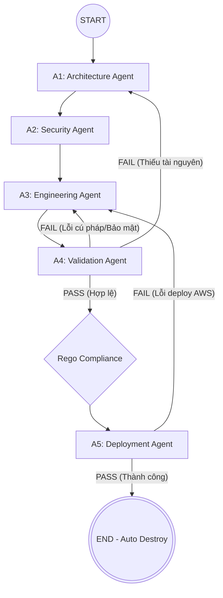

# BÁO CÁO ĐÁNH GIÁ HỆ THỐNG MULTI-AGENT TERRAFORM GENERATION

> [!NOTE]
> Báo cáo này tóm tắt toàn bộ kiến trúc hệ thống sinh mã Terraform tự động bằng mô hình Multi-Agent (LangGraph), phân tích chi tiết từng file mã nguồn, hướng dẫn chạy, đánh giá kết quả kiểm thử và định hướng tối ưu hóa hệ thống.

---

## 1. TỔNG QUAN HỆ THỐNG (OVERVIEW)

Hệ thống **Multi-Agent Terraform Generation** là một đường ống (pipeline) tự động hóa quy trình chuyển đổi yêu cầu bằng ngôn ngữ tự nhiên thành mã hạ tầng dạng mã (IaC) Terraform an toàn, có khả năng triển khai thực tế trên AWS. 

Hệ thống sử dụng **LangGraph** để kết nối 5 Agent chuyên biệt thành một đồ thị có trạng thái (StateGraph), hỗ trợ cơ chế phản hồi sửa lỗi tự động (self-correcting/retry loop) dựa trên phản hồi lỗi thực tế từ trình biên dịch Terraform và công cụ quét bảo mật Checkov.



---

## 2. CHI TIẾT TỪNG FILE TRONG MÃ NGUỒN (SOURCE CODE FILES ANALYSIS)

Cấu trúc thư mục dự án được tổ chức như sau:

| Thư mục / File | Chức năng & Ý nghĩa |
| :--- | :--- |
| **`main.py`** | Entrypoint chính để chạy pipeline với một prompt đơn lẻ hoặc chạy hàng loạt (batch) ở chế độ CLI thông thường. |
| **`test_pipeline.py`** | Script chạy kiểm thử tự động (benchmark) toàn bộ hoặc một phần các test case từ dataset CSV, tích hợp cổng chấm điểm Rego và AWS Deploy. |
| **`graph.py`** | Định nghĩa cấu trúc đồ thị luồng đi của các Agent (LangGraph), các cạnh có điều kiện và cơ chế chuyển đổi trạng thái giữa các Agent. |
| **`agents/`** | Thư mục chứa logic nghiệp vụ và lời gọi LLM của 5 Agents chuyên biệt. |
| **`core/`** | Chứa nhân hệ thống bao gồm: gọi LLM, định nghĩa trạng thái đồ thị (State), bộ phân tích kết quả JSON và wrapper bọc các lệnh CLI Terraform. |
| **`prompts/`** | Lưu trữ các System Prompts và User Templates bằng ngôn ngữ tự nhiên làm chỉ dẫn cho từng Agent. |
| **`dataset/`** | Chứa các file dữ liệu kiểm thử (CSV), các công cụ hỗ trợ lọc dữ liệu và script phân tích kết quả chuyên sâu `analyze_results.py`. |

### Chi tiết các File trong thư mục `agents/`

1. **[architecture.py](file:///home/manhtan/NT114/29-05/multi-agent-secure-deployable-aws-terraform-generation/agents/architecture.py)**: 
   * **Nhiệm vụ:** Nhận prompt yêu cầu của người dùng, phân tích và lên danh sách các tài nguyên AWS cần thiết (`infrastructure_plan`).
2. **[security.py](file:///home/manhtan/NT114/29-05/multi-agent-secure-deployable-aws-terraform-generation/agents/security.py)**:
   * **Nhiệm vụ:** Nhận bản thiết kế kiến trúc từ A1, đối chiếu với bộ quy tắc Checkov để gán các nhãn bảo mật (CKV Rule IDs) cần tuân thủ cho từng tài nguyên.
3. **[engineering.py](file:///home/manhtan/NT114/29-05/multi-agent-secure-deployable-aws-terraform-generation/agents/engineering.py)**:
   * **Nhiệm vụ:** Nhận bản thiết kế và các yêu cầu bảo mật, tiến hành viết mã Terraform HCL thực tế (`main.tf`, `variables.tf`,...).
4. **[validation.py](file:///home/manhtan/NT114/29-05/multi-agent-secure-deployable-aws-terraform-generation/agents/validation.py)**:
   * **Nhiệm vụ:** Chạy cục bộ `terraform validate`, `terraform plan` và quét bảo mật bằng `checkov`. Nếu phát hiện lỗi, nó sẽ trích xuất thông tin lỗi chi tiết, tạo chỉ dẫn sửa đổi (`fix_feedback`) và định tuyến quay lại A1, A2 hoặc A3 để AI tự động sửa.
5. **[deployment.py](file:///home/manhtan/NT114/29-05/multi-agent-secure-deployable-aws-terraform-generation/agents/deployment.py)**:
   * **Nhiệm vụ:** Thực hiện triển khai hạ tầng thực tế lên AWS thông qua `terraform apply`. Nếu apply lỗi, nó sẽ định tuyến quay lại bước sửa mã; nếu thành công, nó sẽ tiến hành hủy tài nguyên (`terraform destroy`) để dọn dẹp hệ thống.

### Chi tiết các File trong thư mục `core/`

* **[state.py](file:///home/manhtan/NT114/29-05/multi-agent-secure-deployable-aws-terraform-generation/core/state.py)**: Định nghĩa cấu trúc `AgentState` lưu trữ toàn bộ trạng thái chạy của đồ thị (các tham số cấu hình, lịch sử lỗi, số lần retry, mã code sinh ra).
* **[llm.py](file:///home/manhtan/NT114/29-05/multi-agent-secure-deployable-aws-terraform-generation/core/llm.py)**: Quản lý kết nối tới API của mô hình ngôn ngữ lớn (NVIDIA NIM hoặc DeepSeek).
* **[terraform.py](file:///home/manhtan/NT114/29-05/multi-agent-secure-deployable-aws-terraform-generation/core/terraform.py)**: Bọc các lệnh thực thi CLI của Terraform (`init`, `plan`, `apply`, `destroy`) và tích hợp lệnh chạy kiểm tra chính sách nghiệp vụ bằng Open Policy Agent (OPA) qua file `.rego`.

---

## 3. HƯỚNG DẪN CHẠY HỆ THỐNG (RUNNING GUIDE)

Để hệ thống hoạt động chính xác, bạn cần kích hoạt môi trường ảo Python và thiết lập API keys trong file `.env`:

### 3.1. Chạy một Prompt đơn lẻ
Sinh mã Terraform và lưu ra file `infra.tf`:
```bash
python main.py "Create an S3 bucket with versioning and server-side encryption" --output infra.tf
```

### 3.2. Chạy thử nghiệm trên bộ dữ liệu (Dataset Benchmark)
Chạy toàn bộ đường ống kiểm thử tự động trên bộ dữ liệu filtered 174 cases (`data-filtered.csv`) sử dụng 4 luồng song song để tăng tốc độ:
```bash
python test_pipeline.py --csv dataset/data-filtered.csv --cases 0-173 --workers 4 --out reviews/pipeline_results_filtered_full.json
```
*Kết quả chạy sẽ được lưu mặc định tại file `reviews/pipeline_results.json`.*

### 3.3. Phân tích kết quả kiểm thử nâng cao
Để đọc và phân loại các lỗi từ file JSON kết quả, hãy chạy công cụ phân tích:
```bash
python dataset/analyze_results.py reviews/pipeline_results_filtered_full.json --csv dataset/data-filtered.csv

# Hoặc phân tích kết quả benchmark hiện tại trong workspace:
python dataset/analyze_results.py result_full_174.json --csv dataset/data-filtered.csv
```

---

## 4. ĐÁNH GIÁ KẾT QUẢ KIỂM THỬ (BENCHMARK EVALUATION)

Dựa trên kết quả benchmark hiện tại **174 cases** trong `result_full_174.json`, chạy với `dataset/data-filtered.csv`, hệ thống đạt các chỉ số sau:

### 4.1. Ý nghĩa các thuộc tính đánh giá

Các thuộc tính trong `final_eval` được dùng để tách bạch lỗi benchmark, lỗi code và lỗi môi trường AWS:

| Thuộc tính | Ý nghĩa |
| :--- | :--- |
| `dataset_resource_ok` | Generated Terraform có đủ resource bắt buộc theo cột `Resource`/`esource` của dataset. Helper/data source được tách riêng để không làm sai điểm resource chính. |
| `intent_literal_ok` | Các literal rõ ràng trong `Prompt`/`Intent` như `lambda.js`, `custom_ttl_attribute`, `password1`, `cron(...)`, `BucketOwner`, `log/` xuất hiện đúng trong code. |
| `terraform_validation_ok` | A4 chạy Terraform validate/plan thành công. Đây là cổng kiểm tra cú pháp, schema provider và một phần logic Terraform trước deploy. |
| `rego_intent_ok` | Code thỏa rule trong cột `Rego intent`. Đây là benchmark gate, không đồng nghĩa tuyệt đối với deployability vì một số Rego có check quá cụ thể. |
| `deploy_ok` | Terraform apply lên AWS và auto-destroy thành công. |
| `predeploy_strict_ok` | `terraform_validation_ok` + `dataset_resource_ok` + `rego_intent_ok` đều pass, chưa tính deploy AWS. |
| `end_to_end_strict_ok` | `predeploy_strict_ok` + `deploy_ok`. Đây là điểm strict benchmark nghiêm ngặt nhất. |
| `code_predeploy_ok` | Code pass Terraform validation, resource match và literal intent; chưa tính Rego và AWS deploy. |
| `deployable_code_ok` | Code validate được và deploy được trên AWS; dùng để đánh giá khả năng chạy thực tế, bỏ qua Rego benchmark. |
| `adjusted_code_success_ok` | Thành công thực dụng: code deploy được, hoặc chỉ bị chặn bởi môi trường AWS/quota. Đây là metric nên dùng khi đánh giá chất lượng code sinh ra. |
| `benchmark_only_rego_fail` | Rego fail nhưng code vẫn validate/resource/literal/deploy OK. Nên đưa vào nhóm audit dataset/Rego, không vội tính là lỗi code. |
| `deploy_environment_blocked` | Code qua các gate chính nhưng AWS account/region/quota/subscription chặn deploy. |

Các `failed_dimensions` có ý nghĩa như sau:

| Dimension | Ý nghĩa |
| :--- | :--- |
| `architecture` | A1 không sinh được architecture plan hợp lệ, thường là không có resource bắt buộc. |
| `engineering` | A3 không sinh được Terraform HCL dùng được. |
| `terraform_validation` | A4 validate/plan fail do cú pháp, schema provider, logic Terraform hoặc lỗi init/timeout. |
| `dataset_resource` | Thiếu resource bắt buộc theo dataset. |
| `intent_literal` | Thiếu literal rõ ràng trong prompt/intent. |
| `rego_intent` | Không pass Rego intent benchmark. |
| `aws_deploy` | Terraform apply AWS fail; cần phân biệt lỗi code với lỗi môi trường/quota. |

### 4.2. Tổng quan kết quả

| Chỉ số | Kết quả | Ý nghĩa |
| :--- | ---: | :--- |
| **A1 Architecture** | **171/174 (98.3%)** | Agent kiến trúc sinh được plan có resource cho hầu hết prompt. |
| **A3 Engineering** | **171/174 (98.3%)** | Các case đi qua A1 hầu hết sinh được Terraform HCL. |
| **A4 Terraform validate/plan** | **151/174 (86.8%)** | Terraform qua validate/plan cục bộ trước khi deploy. |
| **Dataset resource match** | **150/174 (86.2%)** | Resource sinh ra khớp cột `Resource`/`esource` của dataset. |
| **Rego intent** | **99/174 (56.9%)** | Cổng benchmark theo Rego intent, đang là điểm nghẽn lớn nhất. |
| **AWS deploy OK** | **131/174 (75.3%)** | Terraform apply/destroy thành công trên AWS. |
| **Predeploy strict** | **91/174 (52.3%)** | A4 + Resource + Rego đều pass trước deploy. |
| **Strict end-to-end** | **81/174 (46.6%)** | Predeploy strict + AWS deploy OK. |
| **Code predeploy** | **141/174 (81.0%)** | Code đúng cú pháp/resource/literal, chưa tính Rego/AWS. |
| **Deployable code** | **122/174 (70.1%)** | Code validate và deploy được trên AWS. |
| **Adjusted code-success** | **129/174 (74.1%)** | Thành công thực dụng, bỏ qua benchmark-only Rego và AWS env/quota block. |

### 4.3. Failed dimensions

Các chiều lỗi được ghi trong `final_eval.failed_dimensions`:

| Failed dimension | Số lượng | Tỷ lệ |
| :--- | ---: | ---: |
| `rego_intent` | 60 | 34.5% |
| `aws_deploy` | 28 | 16.1% |
| `terraform_validation` | 20 | 11.5% |
| `dataset_resource` | 9 | 5.2% |
| `intent_literal` | 3 | 1.7% |
| `architecture` | 3 | 1.7% |

### 4.4. Phân loại theo hướng xử lý

Kết quả analyzer cho thấy không nên chỉ đọc `Strict end-to-end`, vì strict score trộn lỗi code thật với lỗi benchmark quá chặt và lỗi môi trường AWS:

* **Code/pipeline cần sửa:** 45 cases theo `adjusted_code_success_ok = false`.
* **Benchmark-only Rego:** 41 cases. Các case này có thể validate/deploy được nhưng Rego hoặc dataset kiểm tra quá cụ thể, ví dụ hard-code tên bucket, tên resource Terraform, hoặc kiểm tra biểu thức plan quá chặt.
* **AWS environment/quota:** 7 cases. Các lỗi này do account/region/subscription/quota/permission, không nên tính là lỗi sinh Terraform nếu prompt không yêu cầu đúng service/region bị chặn.

### 4.5. Các nhóm lỗi nổi bật

> [!WARNING]
> * **Rego intent là điểm nghẽn benchmark lớn nhất:** 60/174 case fail Rego, trong đó analyzer phân loại 37 case thuộc nhóm cần audit dataset/Rego và 5 case cần review semantic thủ công.
> * **A4 validation còn 20 case fail:** gồm 16 lỗi `SYNTAX`, 2 lỗi `INFRA`, và 2 lỗi `LOGIC`. Đây là nhóm nên ưu tiên bằng deterministic repair hoặc prompt/schema guard cho AWS Provider ~> 5.0.
> * **Deployability còn 12 case lỗi code chính:** các lỗi thường gặp gồm Route53 query logging region, S3 bucket naming, ElastiCache user id, Lambda handler/package, S3 notification permission/dependency, API Gateway integration, CodeBuild GitHub auth, IAM SSH public key.
> * **Dataset intent/resource mismatch còn 9 case:** thiếu các resource như `aws_s3_bucket`, `aws_dynamodb_table`, `aws_dynamodb_table_replica`, `aws_elasticache_user`, `aws_iam_policy`, `aws_iam_role_policy_attachment`.
> * **AWS environment-only có 7 case:** Firehose subscription, S3 accelerate permission, Lightsail quota, và NLB quota/operation limit.

### 4.6. Hàng đợi tối ưu tiếp theo

* **A1 Architecture:** cases 78, 161, 162 cần template/guard khi LLM chỉ sinh data source mà không có resource.
* **A1/A3 Intent coverage:** cases 28, 29, 50, 74, 76, 80, 114, 116, 122 cần giữ đúng resource/literal trong prompt và intent.
* **A4 Validation:** cases 18, 27, 31, 32, 42, 45, 61, 68, 82, 84, 115, 120, 126, 130, 132, 134, 139, 141, 158, 166 cần schema/logic repair.
* **A5 Deployability:** cases 0, 21, 47, 56, 60, 64, 79, 101, 117, 121, 165, 167 cần deterministic deploy fixes.
* **Dataset/Rego audit:** 37 cases được analyzer gán owner `benchmark_dataset_rego_audit`, cần tách khỏi lỗi sinh code khi báo cáo chất lượng thực dụng.

---

## 5. KẾT LUẬN & ĐỊNH HƯỚNG PHÁT TRIỂN (CONCLUSION & FUTURE WORK)

### 5.1. Kết luận
Hệ thống Multi-Agent sử dụng LangGraph kết hợp vòng lặp sửa lỗi tự động đạt **129/174 (74.1%) Adjusted code-success** và **122/174 (70.1%) Deployable code** trên benchmark filtered 174 cases. Cơ chế cô lập lỗi của Validation Agent (A4) giúp giữ tỷ lệ validate/plan ở **151/174 (86.8%)**. Tuy nhiên, rào cản lớn nhất hiện tại nằm ở độ lệch pha giữa **kịch bản kiểm thử tĩnh (Rego)**, **độ bao phủ intent/resource**, và **điều kiện triển khai thực tế trên AWS**.

### 5.2. Hướng phát triển trong tương lai

1. **Về phía Pipeline & Agents:**
   * **Nâng cấp A4 Validation:** Bổ sung các bộ lọc regex tự động sửa các lỗi thuộc tính cũ của AWS Provider 5.0 (ví dụ tự động bọc cấu hình Splunk đúng chuẩn).
   * **Tối ưu hóa Prompt của A3:** Thêm chỉ thị bắt buộc tạo mật khẩu ngẫu nhiên an toàn có độ dài tối thiểu 16 ký tự để tránh bị AWS API từ chối.
   * **Tối ưu hóa hiệu năng gọi LLM:** Cấu hình cơ chế tự động thử lại (retry) khi gặp lỗi Timeout 120s từ phía nhà cung cấp mô hình.

2. **Về phía Bộ dữ liệu Benchmark (Dataset & Rego):**
   * **Audit lại quy tắc Rego:** Chuyển đổi các bài test Rego từ dạng so khớp chuỗi hằng số cứng nhắc sang kiểm tra cấu trúc/thuộc tính tương đối (như kiểm tra xem giá trị có chứa tiền tố cụ thể thay vì khớp 100% chuỗi tĩnh).
   * **Khắc phục xung đột Deployability:** Cho phép Rego chấp nhận các chuỗi ngẫu nhiên được sinh ra bởi `random_id` khi kiểm tra tên tài nguyên S3 Bucket hoặc Route53 Domain.
