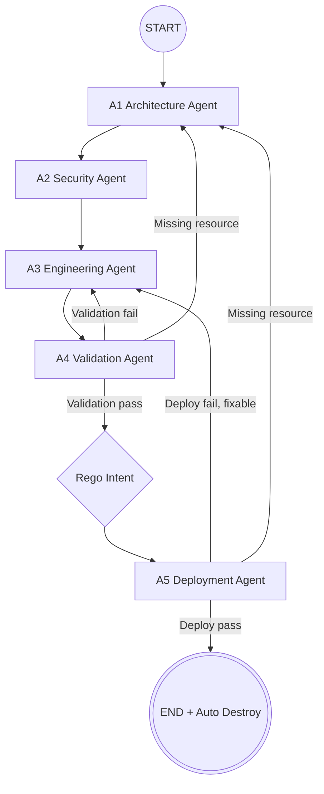

## Overview
Hệ thống **Multi-Agent Terraform Generation** chuyển đổi yêu cầu hạ tầng bằng ngôn ngữ tự nhiên thành Terraform HCL có thể validate, kiểm tra security, đối chiếu intent và deploy thử trên AWS. Pipeline dùng LangGraph để phối hợp nhiều agent chuyên trách: phân tích kiến trúc, hardening security, sinh Terraform, validation, kiểm tra Rego intent và deploy thực tế.

Benchmark mới nhất được ghi trong `result_full_174.json`, chạy trên `dataset/data-filtered.csv` với **174 cases**. Kết quả chính:

| Chỉ số | Kết quả | Nhận xét |
| :--- | ---: | :--- |
| A1 Architecture | 171/174 (98.3%) | Plan kiến trúc ổn định, chỉ 3 case không sinh resource. |
| A3 Engineering | 171/174 (98.3%) | Hầu hết case đi qua A1 đều sinh được Terraform HCL. |
| A4 Terraform validate/plan | 151/174 (86.8%) | Tỷ lệ validate/plan tốt, nhưng còn 20 case cần schema/logic repair. |
| Dataset resource match | 150/174 (86.2%) | Resource coverage khá tốt, còn 9 case thiếu resource theo dataset. |
| Rego intent | 99/174 (56.9%) | Điểm nghẽn lớn nhất của strict benchmark. |
| AWS deploy OK | 131/174 (75.3%) | 131 case apply/destroy thành công trên AWS. |
| Strict end-to-end | 81/174 (46.6%) | Metric nghiêm ngặt nhất: Resource + Rego + validate + deploy. |
| Deployable code | 122/174 (70.1%) | Code validate và deploy được, bỏ qua Rego benchmark. |
| Adjusted code-success | 129/174 (74.1%) | Metric thực dụng nhất: tính code deploy được hoặc chỉ bị chặn bởi AWS environment/quota. |

Kết luận ngắn: pipeline đã đạt mức **deployable code 70.1%** và **adjusted code-success 74.1%** trên benchmark 174 cases. Hạn chế chính hiện tại không nằm ở một điểm duy nhất, mà chia thành ba nhóm: Rego benchmark còn quá chặt, một số lỗi schema/deployability của Terraform/AWS Provider, và các giới hạn môi trường AWS như quota/subscription.

## 1. Phạm Vi Báo Cáo

Báo cáo này tập trung vào:

- Kiến trúc multi-agent và vai trò từng module chính.
- Cách chạy pipeline và benchmark.
- Ý nghĩa các metric trong `final_eval`.
- Kết quả benchmark 174 cases hiện tại.
- Các nhóm lỗi chính và hướng ưu tiên cải thiện.

Nguồn số liệu:

- Result file: `result_full_174.json`
- Dataset: `dataset/data-filtered.csv`
- Lệnh phân tích:

```bash
python dataset/analyze_results.py result_full_174.json --csv dataset/data-filtered.csv
```

## 2. Kiến Trúc Hệ Thống

Pipeline được tổ chức theo mô hình multi-agent. Mỗi agent phụ trách một giai đoạn rõ ràng, giúp hệ thống dễ debug, dễ retry và dễ mở rộng.



### 2.1. Vai Trò Các Agent

| Agent | File chính | Vai trò |
| :--- | :--- | :--- |
| A1 Architecture | `agents/architecture.py` | Phân tích prompt và sinh `infrastructure_plan`: resource, data source, attribute, dependency. |
| A2 Security | `agents/security.py` | Gắn security requirements/CKV IDs dựa trên plan. |
| A3 Engineering | `agents/engineering.py` | Sinh Terraform HCL, thêm provider block và postprocess các lỗi Terraform/AWS phổ biến. |
| A4 Validation | `agents/validation.py` | Chạy `terraform init/validate/plan`, Checkov và sinh fix feedback khi lỗi. |
| Rego Intent | `core/terraform.py`, `benchmark_pipeline.py` | Chạy OPA/Rego trên JSON plan để đối chiếu intent của dataset. |
| A5 Deployment | `agents/deployment.py` | Chạy `terraform apply`, auto-destroy, phân loại lỗi deploy và route retry. |

### 2.2. Các File Và Thư Mục Chính

| Path | Mục đích |
| :--- | :--- |
| `main.py` | Entry point cho một prompt đơn lẻ hoặc flow sử dụng trực tiếp. |
| `benchmark_pipeline.py` | Benchmark runner cho dataset CSV, ghi JSON result đầy đủ. |
| `graph.py` | Định nghĩa LangGraph và routing giữa các agent. |
| `core/state.py` | Định nghĩa state dùng chung trong pipeline. |
| `core/terraform.py` | Wrapper cho Terraform, Checkov, OPA/Rego và file stubs. |
| `core/llm.py` | Kết nối LLM provider như NVIDIA NIM hoặc DeepSeek. |
| `dataset/analyze_results.py` | Analyzer đọc result JSON và phân loại lỗi theo hướng xử lý. |
| `tests/test_static_rules.py` | Unit tests cho static rules, analyzer flags và deterministic repairs. |

## 3. Cách Chạy Hệ Thống

### 3.1. Chuẩn Bị `.venv`

```bash
python3.11 -m venv .venv
source .venv/bin/activate
python -m pip install --upgrade pip
pip install -r requirements.txt
```

Kiểm tra nhanh:

```bash
which python
python --version
terraform version
checkov --version
aws --version
```

### 3.2. Chạy Một Prompt

```bash
python main.py "Create an S3 bucket with versioning and server-side encryption"
```

Ghi Terraform ra file:

```bash
python main.py "Create a private VPC with two subnets" --output infra.tf
```

Destroy resources từ Terraform file đã có:

```bash
python main.py --destroy infra.tf
```

### 3.3. Chạy Benchmark

Chạy toàn bộ `dataset/data-filtered.csv` 174 cases:

```bash
python benchmark_pipeline.py --csv dataset/data-filtered.csv --cases 0-173 --workers 4 --out reviews/pipeline_results_filtered_full.json
```

Phân tích result:

```bash
python dataset/analyze_results.py reviews/pipeline_results_filtered_full.json --csv dataset/data-filtered.csv
```

Phân tích result hiện tại trong workspace:

```bash
python dataset/analyze_results.py result_full_174.json --csv dataset/data-filtered.csv
```

### 3.4. Kiểm Tra Nhanh Trước Khi Chạy Benchmark Tốn AWS/LLM

```bash
python -m unittest tests/test_static_rules.py
python -m py_compile agents/architecture.py agents/deployment.py agents/validation.py core/terraform.py benchmark_pipeline.py dataset/analyze_results.py
```

## 4. Ý Nghĩa Các Metric

Các metric trong `final_eval` giúp tách bạch ba loại vấn đề: lỗi code sinh ra, lỗi benchmark/Rego, và lỗi môi trường AWS.

| Thuộc tính | Ý nghĩa |
| :--- | :--- |
| `dataset_resource_ok` | Generated Terraform có đủ required resource theo dataset. |
| `intent_literal_ok` | Các literal quan trọng trong prompt/intent xuất hiện đúng trong code, ví dụ `lambda.js`, `cron(...)`, `BucketOwner`, `log/`. |
| `terraform_validation_ok` | A4 validate/plan pass. Đây là gate cú pháp, schema provider và logic Terraform cơ bản. |
| `rego_intent_ok` | Code pass rule trong cột `Rego intent`. Đây là benchmark gate, không phải lúc nào cũng phản ánh deployability. |
| `deploy_ok` | Terraform apply và auto-destroy thành công trên AWS. |
| `predeploy_strict_ok` | `terraform_validation_ok` + `dataset_resource_ok` + `rego_intent_ok`. |
| `end_to_end_strict_ok` | `predeploy_strict_ok` + `deploy_ok`. Đây là strict benchmark nghiêm ngặt nhất. |
| `code_predeploy_ok` | Code pass validation/resource/literal, chưa tính Rego và AWS deploy. |
| `deployable_code_ok` | Code validate được và deploy được trên AWS, bỏ qua Rego benchmark. |
| `adjusted_code_success_ok` | Metric thực dụng: deploy được, hoặc chỉ bị chặn bởi AWS environment/quota. |
| `benchmark_only_rego_fail` | Rego fail nhưng code vẫn qua các gate thực dụng. Nên audit dataset/Rego trước khi tính là lỗi code. |
| `deploy_environment_blocked` | Code qua các gate chính nhưng bị AWS account/region/quota/subscription chặn deploy. |

Các `failed_dimensions`:

| Dimension | Ý nghĩa |
| :--- | :--- |
| `architecture` | A1 không sinh được plan hợp lệ hoặc không có resource. |
| `engineering` | A3 không sinh được Terraform HCL dùng được. |
| `terraform_validation` | A4 validate/plan fail do syntax, schema, logic, init hoặc timeout. |
| `dataset_resource` | Thiếu required resource theo dataset. |
| `intent_literal` | Thiếu literal rõ ràng trong prompt/intent. |
| `rego_intent` | Không pass Rego intent benchmark. |
| `aws_deploy` | AWS apply fail. Cần phân biệt lỗi code với lỗi quota/subscription/permission. |

## 5. Kết Quả Benchmark 174 Cases

### 5.1. Quality Gates

| Gate | Kết quả | Nhận xét |
| :--- | ---: | :--- |
| A1 Architecture | 171/174 (98.3%) | 3 case chỉ sinh data source hoặc thiếu resource. |
| A3 Engineering | 171/174 (98.3%) | Không có lỗi engineering riêng ngoài các case A1 fail. |
| A4 Terraform validate/plan | 151/174 (86.8%) | Còn 20 case validation fail. |
| Dataset resource match | 150/174 (86.2%) | Còn 9 case thiếu required resource. |
| Rego intent | 99/174 (56.9%) | Cổng có tỷ lệ fail cao nhất. |
| AWS deploy OK | 131/174 (75.3%) | 28 case deploy fail, trong đó có 7 case do môi trường AWS. |
| Predeploy strict | 91/174 (52.3%) | Strict trước deploy. |
| Strict end-to-end | 81/174 (46.6%) | Strict benchmark đầy đủ. |
| Code predeploy | 141/174 (81.0%) | Đánh giá code trước Rego/AWS. |
| Deployable code | 122/174 (70.1%) | Code chạy được trên AWS. |
| Adjusted code-success | 129/174 (74.1%) | Metric nên dùng để đánh giá chất lượng code thực dụng. |

### 5.2. Failed Dimensions

| Failed dimension | Số case | Tỷ lệ |
| :--- | ---: | ---: |
| `rego_intent` | 60 | 34.5% |
| `aws_deploy` | 28 | 16.1% |
| `terraform_validation` | 20 | 11.5% |
| `dataset_resource` | 9 | 5.2% |
| `intent_literal` | 3 | 1.7% |
| `architecture` | 3 | 1.7% |

### 5.3. Phân Nhóm Lỗi Theo Hướng Xử Lý

| Nhóm | Số case | Ý nghĩa |
| :--- | ---: | :--- |
| Code/pipeline cần sửa | 45 | Các case fail do architecture, validation, resource coverage, literal intent hoặc deployability. |
| Benchmark-only Rego | 41 | Code qua các gate thực dụng nhưng fail Rego do rule quá cụ thể hoặc conflict với deployability. |
| AWS environment/quota | 7 | Bị chặn bởi subscription, quota, permission hoặc giới hạn region/account. |
| Manual semantic review | 5 | Cần đọc prompt, generated HCL và Rego để kết luận đúng/sai. |

## 6. Phân Tích Các Nhóm Lỗi Chính

### 6.1. Rego Intent Là Điểm Nghẽn Benchmark

`rego_intent` fail 60 cases. Trong đó, analyzer phân loại 37 cases vào nhóm `benchmark_dataset_rego_audit`. Các lỗi phổ biến:

- Rego hard-code tên Terraform resource hoặc tên cloud resource.
- Rego kiểm tra exact constant quá chặt.
- Rego dùng biểu thức plan/configuration không ổn định.
- Dataset/Rego yêu cầu tên cố định như S3 bucket name, trong khi deploy thực tế cần tên unique toàn cục.

Khuyến nghị: không dùng `Strict end-to-end` làm metric duy nhất. Khi báo cáo chất lượng code sinh ra, nên đi kèm `Deployable code` và `Adjusted code-success`.

### 6.2. A4 Validation Còn 20 Cases Fail

Các lỗi A4 gồm:

- 16 case `SYNTAX`
- 2 case `INFRA`
- 2 case `LOGIC`

Nhóm này nên ưu tiên vì có tác động trực tiếp đến khả năng deploy. Các case cần xử lý: 18, 27, 31, 32, 42, 45, 61, 68, 82, 84, 115, 120, 126, 130, 132, 134, 139, 141, 158, 166.

### 6.3. Deployability Còn 12 Cases Lỗi Code Chính

Các lỗi deployability thường gặp:

- Route53 query logging yêu cầu CloudWatch log group ở `us-east-1`.
- S3 bucket name không hợp lệ hoặc bị trùng global namespace.
- ElastiCache user id/user name không đúng constraint.
- Lambda handler/package không khớp.
- S3 notification thiếu destination policy hoặc dependency.
- API Gateway integration/method mapping sai.
- CodeBuild GitHub auth/source config chưa deploy được.
- IAM SSH public key không hợp lệ.

Các case ưu tiên: 0, 21, 47, 56, 60, 64, 79, 101, 117, 121, 165, 167.

### 6.4. Intent Coverage Và Dataset Resource Match

`dataset_resource` fail 9 cases, thường do thiếu resource bắt buộc như:

- `aws_s3_bucket`
- `aws_dynamodb_table`
- `aws_dynamodb_table_replica`
- `aws_elasticache_user`
- `aws_iam_policy`
- `aws_iam_role_policy_attachment`

Các case ưu tiên: 28, 29, 50, 74, 76, 80, 114, 116, 122.

### 6.5. AWS Environment/Quota Không Nên Tính Là Lỗi Code

Có 7 cases bị chặn bởi AWS environment/quota:

- Firehose subscription/service availability.
- S3 accelerate permission.
- Lightsail quota.
- NLB operation/quota limit.

Những case này nên được ghi nhận riêng bằng `deploy_environment_blocked`, không nên tính trực tiếp là lỗi generated Terraform nếu prompt không yêu cầu đúng môi trường bị chặn.

## 7. Roadmap Cải Thiện

### Ưu Tiên 1: Giảm Lỗi A4 Validation

- Bổ sung deterministic repair cho AWS Provider schema phổ biến.
- Tăng prompt guard cho các resource có schema phức tạp như Firehose, S3 inventory, DynamoDB replica, ElastiCache, CodeBuild.
- Tách lỗi `INFRA` như timeout/init failure khỏi lỗi Terraform syntax để xử lý đúng hướng.

### Ưu Tiên 2: Cải Thiện Deployability

- Thêm deploy repair cho Route53 query logging region.
- Chuẩn hóa S3 naming strategy: dùng `bucket_prefix` hoặc random suffix khi cần deploy thật.
- Sửa các pattern deploy fail lặp lại: Lambda package/handler, S3 notification dependency, API Gateway mapping, IAM SSH public key.

### Ưu Tiên 3: Tăng Intent Coverage

- Bổ sung A1 deterministic templates cho cases 78, 161, 162 khi LLM chỉ sinh data source.
- Tăng guard để A1/A3 giữ literal quan trọng trong prompt.
- Ưu tiên các resource bị thiếu theo dataset: S3, DynamoDB, ElastiCache user, IAM policy/attachment.

### Ưu Tiên 4: Audit Dataset/Rego

- Chuyển Rego từ exact-name matching sang structural/semantic matching khi có thể.
- Tránh yêu cầu fixed S3 bucket name nếu mục tiêu là deploy thật.
- Tách benchmark-only Rego fail khỏi code failure trong báo cáo kết quả.

## 8. Kết Luận

Hệ thống đã đạt mức khả dụng tốt cho bài toán sinh Terraform deployable: **122/174 (70.1%) Deployable code** và **129/174 (74.1%) Adjusted code-success**. Pipeline có nền tảng ổn định ở A1/A3, validate rate khá cao ở A4, và đã deploy thành công 131 cases trên AWS.

Để nâng chất lượng lên mức cao hơn, trọng tâm tiếp theo nên là: giảm 20 lỗi A4 validation, xử lý 12 lỗi deployability có tính lặp lại, tăng intent/resource coverage, và audit lại các Rego rule quá chặt. Khi trình bày kết quả, nên báo cáo song song `Strict end-to-end`, `Deployable code`, và `Adjusted code-success` để phản ánh đầy đủ cả benchmark score lẫn giá trị thực tế của generated Terraform.
